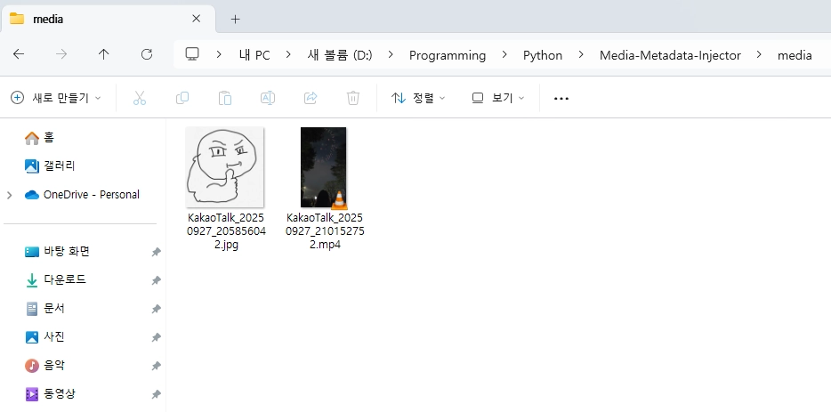
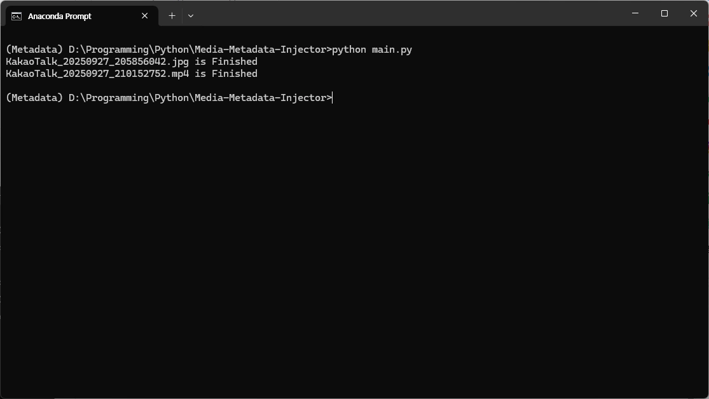
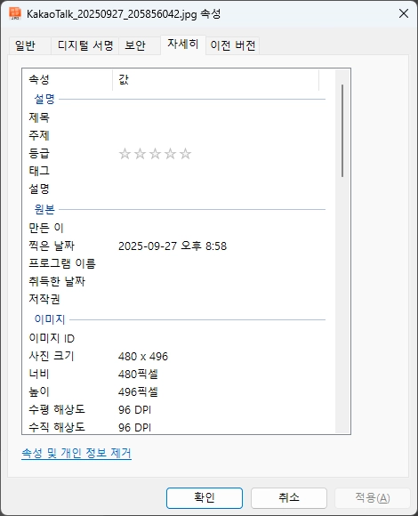

# Media-Metadata-Injector
File Name-Based Metadata Insertor in Media Files Downloaded to KakaoTalk

# Requirement
* Python3.13

# License
BSD 3-Clause License

# How to Use
1. Install pip requirements first
```bash
pip install -r requirements.txt
```
2. Run **main.py**
```bash
python main.py
```
3. Place the KakaoTalk media files you want to change in the **media** folder


4. Run the main.py script


5. Check your results

